<properties
	pageTitle="Instructions for using Interactive Data Exploration, Analysis and Reporting (IDEAR) in MRS"
	description="To provide a flexible and interactive tool for data exploration, visualization, analysis, and pattern recognition."  
	services="machine-learning"
	documentationCenter=""
	authors="bradsev"
	manager="jhubbard"
	editor="cgronlun" />

<tags
	ms.service="machine-learning"
	ms.workload="data-services"
	ms.tgt_pltfrm="na"
	ms.devlang="na"
	ms.topic="article"
	ms.date="09/24/2016"
	ms.author="bradsev;hangzh;"/>

# Instructions for using Interactive Data Exploration, Analysis and Reporting (IDEAR) in MRS for Big Data

The Interactive Data Exploration, Analysis and Reporting (IDEAR) tool provides a flexible and interactive means for data exploration, visualization, analysis, and pattern recognition. These instructions provide a step by step guide on how to use IDEAR in MRS to explore and analyze some sample data interactively, and then how to export the results of visualization and analysis to a report with a few clicks of a button. Specifically, IDEAR in MRS allows you to explore, visualize, and analyze **big data** on your hard disk interactively. 

>[AZURE.NOTE] Sometimes visualizing big data, such as scatter plotting millions of data points, can significantly slow down the interactivity. In such situation, IDEAR is still plotting on sampled data. 

> Microsoft offers **free** [Microsoft R Server Developer Version](https://blogs.technet.microsoft.com/machinelearning/2016/01/12/making-r-the-enterprise-standard-for-cross-platform-analytics-both-on-premises-and-in-the-cloud/). 
> 
> If you are using an [Azure Data Science Virtual Machine](http://aka.ms/dsvmhandout), MRS developer version is already installed. You can start using IDEAR in MRS instantly.

## Prerequisites

You need to install the following programs to use IDEAR:

1. [Microsoft R Server(MRS)](https://msdn.microsoft.com/en-us/microsoft-r/rserver)
2. RStudio or Visual Studio with [RTVS](http://microsoft.github.io/RTVS-docs/).
3. If you are using Linux DSVM on a Windows machine, you can [install x2go on your client](https://azure.microsoft.com/en-us/documentation/articles/machine-learning-data-science-linux-dsvm-intro/#installing-and-configuring-x2go-client) to log into the Linux DSVM. The X2Go interface appears as shown in the following figure:

>[AZURE.NOTE] The first time you run IDEAR, it checks whether you have all the dependent libraries installed. It may take 5-10 minutes to install the missing libraries like shiny and knitr. After the installation of missing libraries completes, stop IDEAR, restart RStudio, and run IDEAR again.
>

## Conventions, limitations, and the configuration of IDEAR

### Column name conventions for IDEAR in MRS

Before you run IDEAR in MRS, make sure that the **column names** in the data file or in the SQL query result, use the following conventions:

- Column names have to **start with alphabet letters**. Column names cannot start with numbers or special characters. 
- **Special characters**, except the underscore, are **not allowed** in column names. Even a space character is not allowed in a column name.  

### IDEAR in MRS works on local data files

Currently, IDEAR in MRS works on data in local csv, tsv, or xdf files, or data in SQL query results.

### Use a YAML file to provide data source, data format, and column information to IDEAR

A YAML file is needed to provide information about the data, such as the location of the data, the format of the data file (such as column separator and whether there is a headerline or not), and various other parameters IDEAR needs.

>[AZURE.NOTE]: In the YAML file, you need to set the path to your data file correctly. Note that Windows and Linux have different conventions for directory structures (“\\” for Windows and “/” for Linux). So, based on the OS of your machine, you need to set the path appropriately.

These two tables list the parameters you need to fill in the YAML file, depending on where the data is. We currently support only two types of data files:

- Data that is in a local file (tsv, csv, or xdf)
- Data that is a query result from a SQL Server database.

An example YAML file can be found at [para-adult.mrs.yaml](para-adult-mrs.yaml).

** Data stays in a local flat text file: **

| Parameter Name | Value | Description | Example |
|:---------------|:-------------|:----------------------|:-----------------|
|DataFilePath    | Path to the local data | **Required**. (Full or relative) path and name to the data file. Use '\\' to separate directories and file names. | ..\\..\\Data\\Common\\data.csv |
|HasHeader | Yes or No | **Required**. Specify whether the first line is a headerline. | Yes |
|Separator | ',', '\t', etc| **Required**. The separator of columns in the data file. | ',' |
|SampleRecords | Integer value| **Optional**. The number of rows to sample from the original dataset. The default value is 10000 if unspecified| 10000 |
|RowsPerRead | Integer value| **Optional**. The number of rows each read when creating XDF files. The default value is 500000 | 500000 |
|Target | Name of the machine learning target column | **Optional**. If not provided, this is just a data exploration task. | is_fraud |
|CategoricalColumns | Names of categorical columns | **Optional**. If not provided, IDEAR automatically detects the column type. | - gender |
|NumericalColumns | Names of numerical columns | **Optional**. If not provided, IDEAR automatically detects the column type. | - education_years |
|DateTimeColumns | Names of datetime columns | **Required** if you want to treate some columns as datetime fields. In the format of `- ColumnName: Format String`. | - Col1 : "%Y-%m-%d %H:%M:%S" | 
|ColumnsToExclude | Names of columns to exclude | **Optional**. If not provided, IDEAR analyzes all columns. | - UserID |
|RLogFilePath | Path and name of an R file to be created | **Required**. Path and name of an R file to hold the R scripts that a user export from the IDEAR interactive user interface. This file executes to generate the data report. | fraud.log.r |

If you specify some columns as **DateTimeColumns**, IDEAR will convert these columns into **datetime** objects in R, and extract datetime componnets `Year`, `Month`, `Week Number`, `Day of Month`, `Day of Week`, `Hour of Day`, `Minute`, `Second` from these objects. These datetime component columns, if not constant, will be added to the the right side of the original dataset, and column names will be `<Original DateTime Column Name>_autogen_year`, `<Original DateTime Column Name>_autogen_month`, etc. They will be treated as categorical columns. The data exploration and analysis will be conducted on the dataset with these extra datetime component columns.
After extracting datetime components, the original datetime columns are not needed further analysis. Therefore they are added to `ColumnsToExclude`. 

If the data source is local files, IDEAR will save the augmented data with datetime component columns to a local file, in the same directory of DataFilePath, with name __dt\_components_ added to the original file name. For instance, if the original data file is _C:\\temp\\a.csv_, the augmented data will be saved as _C:\\temp\\a_dt_components.csv_. 

To practice with the automatic datetime component extraction from **DateTimeColumns**, you can use the bike rental data coming with IDEAR. In the bike rental data, there is a datetime column `dteday`. When IDEAR asks you to choose a YAML file, just choose para-bike-rental-hour.yaml. 

** Data is a query result from a SQL database: **

If the data is the result of a SQL query of a SQL database, you do not need the first three parameters in the table above. Instead, you need the following parameters:

| Parameter Name | Value | Description | Example |
|:---------------|:-------------|:----------------------|:-----------------|
|DataSource    | SQLServer | **Required**. _SQLServer_ is the only valid value for now. But this value is valid for both SQL database, and SQL Data Warehouse.| SQLServer |
|Server | URL to the database server | **Required**. URL to the database server | mysqlserver.database.windows.net |
|Database | Database name | **Required**. Name of the database from which to query | SQLDWTDSP |
|Username | username | **Required**. User name that can log in to the Server to run query. | datascience |
|Password | password of the username | **Required**. Password of the user that can log in to the Server to run query. | HelloWorld! |
|Query | SQL query | **Required**. Query to get the data from the database. Can be query on a single or joining multiple tables.| select * from table1 |

During interactive data exploration, you can:

- choose which **variables** to explore and visualize. 
- export an R script that generates interesting results in IDEAR to an **R script log file** with the click of a button.
- generate a final report on the results of your data exploration by clicking the **Generate Report** button to execute the R script log file. 

## Sample Dataset

To help you try IDEAR quickly, two sample datasets come packaged with IDEAR in the **Data\\Common** directory.  

In this tutorial, we show you how to run IDEAR in MRS using the [UCI Census Income](https://archive.ics.uci.edu/ml/datasets/Census+Income) dataset as an example. The data is located at **Data\\Common\\UCI_Income** directory. The [para-adult-mrs.yaml](para-adult-mrs.yaml) file for this dataset is in the same directory as this instruction. 

In the following example, **label.IsOver50**K (the income is over 50K) is specified as the target (dependent) variable in the YAML file.

## How to Launch IDEAR

You can launch IDEAR from RStudio (run on either Linux or Windows) or Visual Studio R Project. Here are the instructions:

### 1. RStudio
- To start RStudio **on Linux**, double-click the RStudio icon on the desktop. If you do not see the icon, go to **Applications** --> **Run Program** --> type **rstudio**

	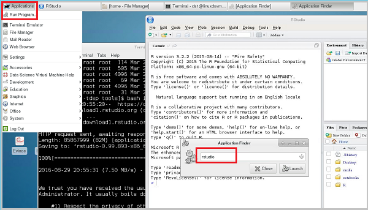

- To start RStudio **on Windows**, double-click the RStudio icon on the desktop. 
	Make sure that your RStudio uses the installed MRS 

	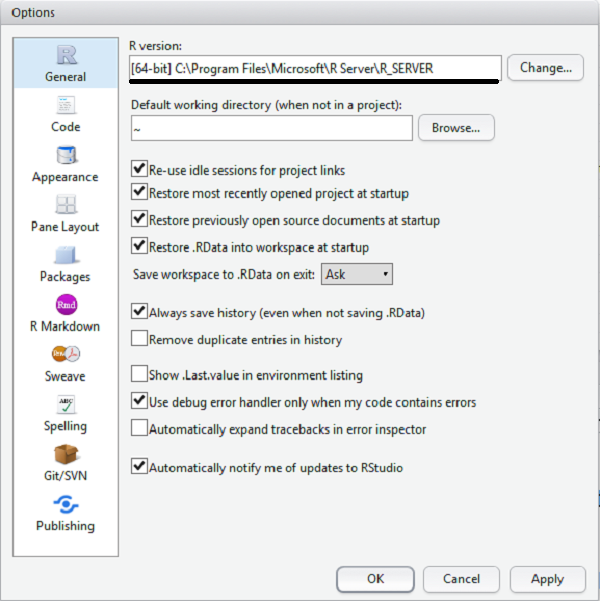
- Open [Run-IDEAR-MRS.R](Run-IDEAR-MRS.R) file in RStudio, and source it to run. Then a file chooser will open.
- To launch IDEAR, navigate to the desired YAML file (para-adult.yaml for example) in **File Explorer** window that pops up and click **Open**.

	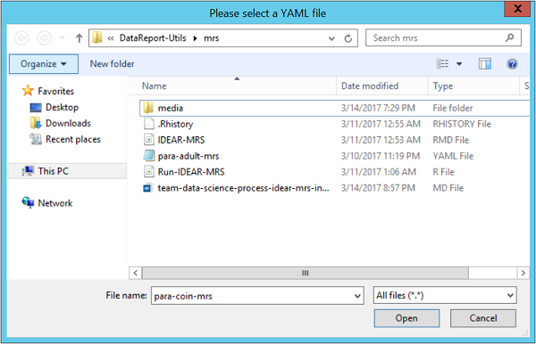

### 2. Visual Studio with RTVS

- Start Visual Studio with RTVS
- Set your system default internet browser to Chrome or Firefox
- Configure R environment and Shiny browser with R Tools->Options->R Tools->Advanced
	- set R Engine (64-bit) to your MRS installation path
	- set Shiny pages browser to External

	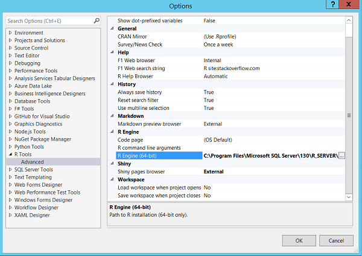
- Open Run-IDEAR-MRS.R in Visual Studio and source the R file with R Tools->Session->Source R script

	

- Click **OK** to continue when a message window pops up to remind that you need to select a YAML file in the next popup windows.

- To launch IDEAR, navigate to the desired YAML file (para-adult-mrs.yaml for example) in **File Explorer** window that pops up and click **Open**.

>[AZURE.ALERT] Make sure that DataFilePath in YAML file points to your data file.

## How to use IDEAR

IDEAR guides you through the exploration of a dataset in an evolving manner:

- from a general data summary to specific variable statistics
- from simple to complex
- from single variable to multiple variables 

During the interactive process of data exploration, analysis, and visualization, you can click the **Export** button for each analysis and visualization. The R scripts used to generate the results of your analysis and visualization are output/appended to an **R script log file** you specified in the YAML file. You can generate a final data report from that R script log file. Click the **Generate Report** button to execute the R script log file to produce the report. You can then share this report with your project teammates or with your clients to discuss what insights you obtained from your exploration of the data. 

Use the floating table of contents (TOC) on the left top corner of the IDEAR launch page to navigate through the sequence of panes that this tool displays. The numbering of the following sections is aligned with those panes of the IDEAR TOC.

## 1. Task Summary

This section describes the types of the machine learning tasks for which IDEAR can be used. This task is determined by the type of data in the target column specified in the YAML file:

- the task type is **classification** if the target column is **categorical**. 
- the task type is **regression** if the target column is **numerical**.
- the task type is just **data exploration** if no target column is specified. 

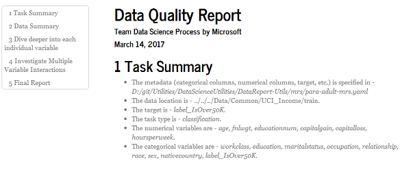

## 2. Data Summary

This section describes the four IDEAR panes that characterize different aspects of the data:

- Take a **peek** of the data
- **Dimension** of the data
- **Names and type**s of columns
- Basic **statistics** of columns

### 2.1 Take a peek of the data

By default, only the top 10 rows of data are displayed. Examining the first 10 rows of data gives you a sense of the data schema quickly. If you need to see more or fewer rows, you can change the number of rows to display in the **Top Rows** box.

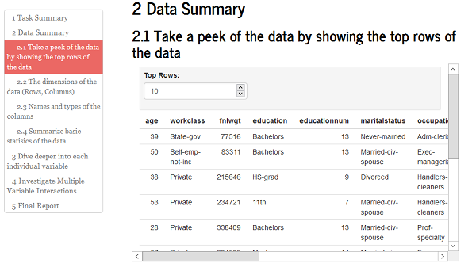

### 2.2 Dimension of the data

Here is where you specify the number of rows and columns of the data to export.

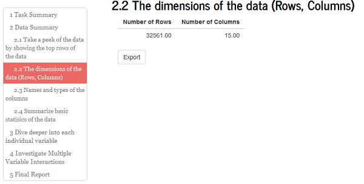

### 2.3 Names and types of columns

Here you see the column names and data types of the first 10 columns by default. If you need to see more or less columns, you can change the number of rows to display in the **Show Columns** box. If the number of columns specified in the dialogue box is greater than or equal to the total number of columns in the data frame, the names and types of all columns are displayed.

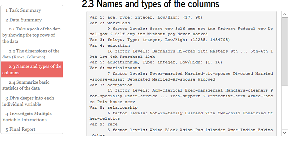

### 2.4 Basic statistics of columns

Basic summary statistics of each column are displayed in this pane. 

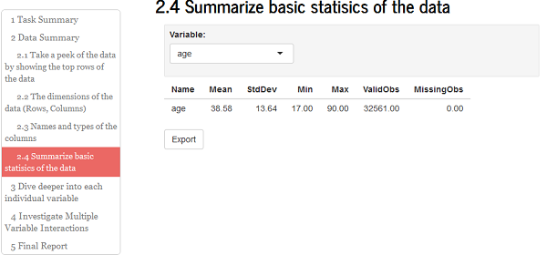

## 3. Deep dive into individual variables

This section describes the more detailed statistics and visualization for target and feature variables provided by the IDEAR panes.

### 3.1-3 Visualization of target and feature variables

The visualizations are divided into three panes by variable type:

- 3.1 **target** variable (dependent variable)
- 3.2 **categorical** feature variables
- 3.3 **numerical** feature variables

When visualizing numerical variables, a normality test is also conducted and the test results are printed out at the top of the plot. If you see a p-value < 0.05, the null hypothesis that the variable follows a normal distribution is rejected, and result is printed in red. Otherwise, the null hypothesis is not rejected and the p-value is printed in blue. The p-value is rounded to 6th decimal. 

You can change which variables to explore by selecting from the drop list. 

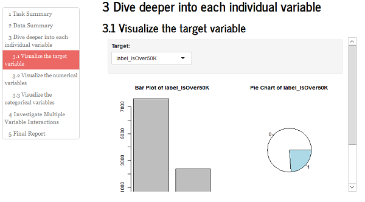

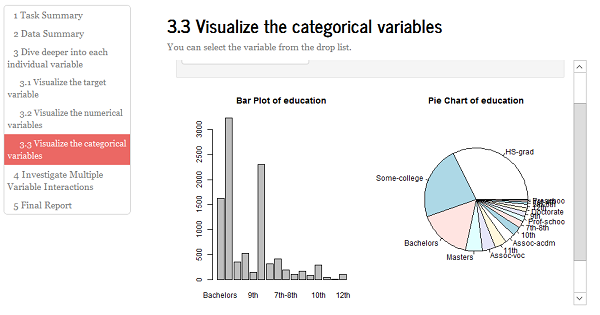

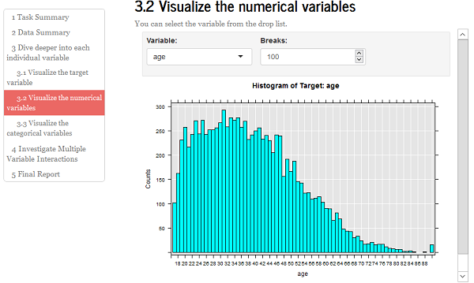

## 4. Multiple variable interactions

Investigating the interactions and association between variables is an important analysis for understanding the dataset and for determining whether a dataset is relevant for the machine learning task, even before building machine learning models. In this section, we show how to evaluate and visualize inter-variable associations and the subsections corresponds to the IDEAR panes:

- 4.1 Rank variables
- 4.2 Visualize interactions between categorical variables
- 4.3 Visualize interactions between numerical variables
- 4.4 Visualize correlation matrix of numerical variables
- 4.5 Visualize interactions between numerical and categorical variables via box plot
- 4.6 Visualize interactions between numerical and categorical variables via histogram
- 4.7 Visualize interactions between numerical variables grouped by categorical variables
- 4.8 Visualize data patterns in lower dimensional space spanned by principal components

### 4.1 Rank variables

IDEAR calculates the strength of association between variables in the dataset. You choose a specific variable from the drop list and specify the number of top numerical and categorical variables to analyze. IDEAR then shows the top n variables in two bar charts, one for the top numerical variables, and the other one for the top categorical variables. If the variable selected in the drop-down list is the target variable (the default if target variable is specified in the YAML file), this function helps you rank the variables based on strength of associations with the target variable. 

- The associations between categorical and numerical variables are computed using the [eta-squared metric](https://en.wikiversity.org/wiki/Eta-squared "Eta-squared metric"). 
- The associations between categorical variables are computed using the [Cramer' V metric](https://en.wikipedia.org/wiki/Cram%C3%A9r%27s_V "Cramer's V metric").

Since variable ranking can be slow, especially when you have a lot of variables, this function is only activated after you click the **Go** button. 

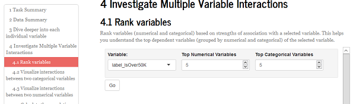

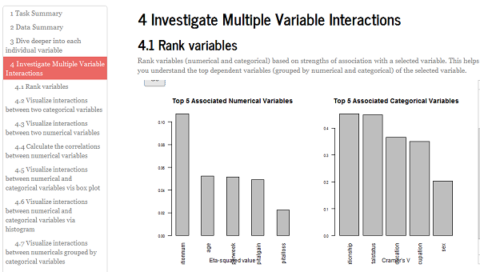

>[AZURE.ALERT] If you notice that certain variables have significantly stronger associations with the target variable than others, they might be **target leakers** that already contain information from the target variable. Think it twice, or consult someone who has domain expertise if this situation arises.

### 4.2 Visualize interactions between categorical variables

A [mosaic plot](http://www.datavis.ca/online/mosaics/about.html#toc1 "two-way mosaic plot") shows the proportion of one categorical variable within the classes of another using tiles whose size is proportional to the cell frequency of a 2-way contingency table. The two categorical variables are selected from the drop-down menu boxes. The tiles are colored according to Standardized Pearson residuals (see the previous link). This helps you understand whether two categorical variables are dependent or not.

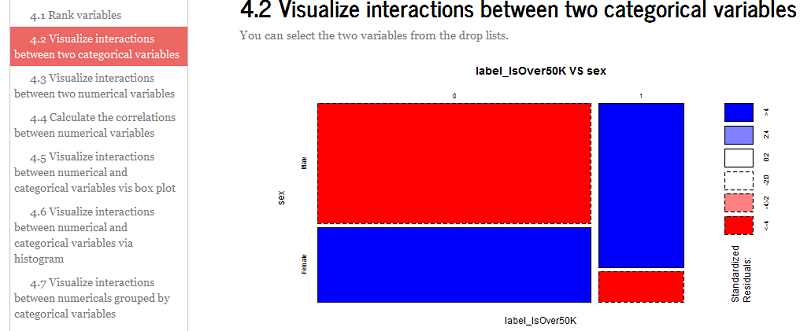

### 4.3 Visualize interactions between numerical variables

A correlation plot shows the association between pairs of numerical variables in the dataset. The two numerical variables are selected from the drop-down menu boxes. 

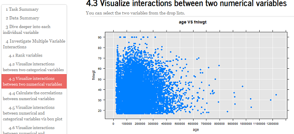

### 4.4 Visualize correlation matrix of numerical variables

An all-by-all pair-wise correlation plot shows the association between all pairs of numerical variables the dataset. You must specify the following parameters from the dropdown menus:

- **Correlation method**: pearson, kendall, spearman
- **Order**: AOE, FPC, hclust, alphabet
- **Shape**: circle, square, ellipse, number, shade, color, pie
- **Layout**: full, upper, lower

For information on these parameters, see [https://cran.r-project.org/web/packages/corrplot/vignettes/corrplot-intro.html](https://cran.r-project.org/web/packages/corrplot/vignettes/corrplot-intro.html) 

If you have a large number of numerical variables, the correlation matrix is displayed in a segmented pattern. In a segmented correlation plot, variables are grouped so that variables within each group have strong mutual correlations. Variables in the same group are displayed in consecutive rows and columns in the correlation plot. 

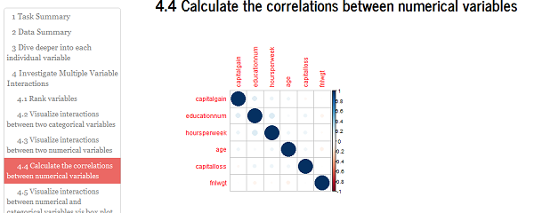

### 4.5 Visualize interactions between numerical and categorical variables via box plot

The association between a numerical and a categorical variable can be evaluated using a box plot. ANOVA is conducted to test the null hypothesis that the mean values of the numerical variable are the same across the levels of the categorical variable. The p-value of the ANOVA test is shown. If the categorical variable is the target variable for a classification problem, this function indicates whether the numerical variable helps differentiate the different levels of the target variable.

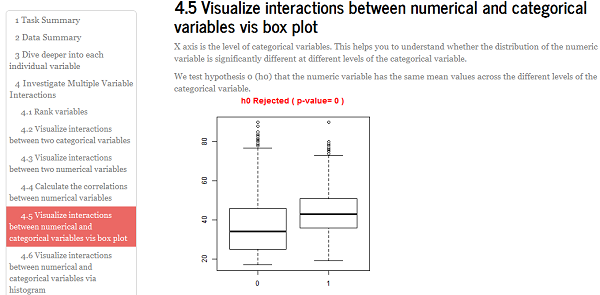

### 4.6 Visualize interactions between numerical and categorical variables via histogram

The distribution of numerical variables can be imppacted by the value of the categorical variables. 

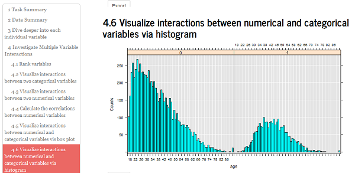

### 4.7 Visualize interactions between numerical variables grouped by categorical variable

The scatter plot of two numerical variables grouped by a categorical variable. 

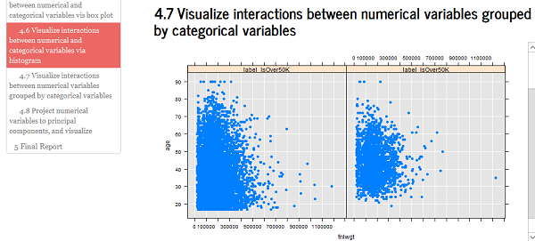

### 4.8 Visualize data patterns in lower dimensional space spanned by principal components

When the dimension of the data is high, data visualization is challenging. But visualizing the data can help us understand the clustering pattern in the data. If you see separated clusters in the data that are dominated by different classes of the target variable, you may estimate that this classification task might not be so challenging. Otherwise, the classification task might not be easy. You can also use this function to infer the quality of your feature set. 

This function projects the numerical sub-dataset onto a lower 2-D or 3-D space spanned by the principal components. You can choose the principal components for x, y, or z axis using the dropdown menus provided in the IDEAR pane. Changing principal components for these three axes might help reveal some clustering patterns that might be hidden when viewing in other principal component axis.  

The bar chart of the percentage of variance explained by the number of principal components can help you understand how severe the multicollinearity is in the numerical sub-dataset. Put another way, it describes how singular the variance-covariance matrix is. 

In the 3-D projection scatter plot, there is a horizontal scroll bar for you to change the viewing perspective. Some clusters might be hidden behind some other clusters when you look at the plot from one angle. Changing to other angles might help you reveal these hidden clusters. 

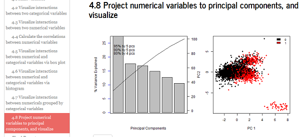

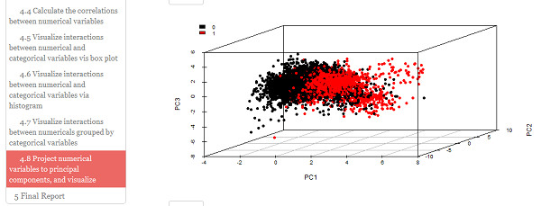

## 5. Generating the final report

When you are ready to generate the data report, click the **Generate Report** button on the **Final Report** IDEAR pane. This executes the log R file specified in the YAML file. If YAML file does not specify a directory for the log R file, the report is saved as an HTML file in the current working directory. 

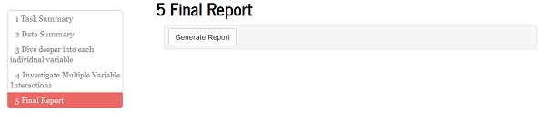

After the report is saved, you can click **View Report** to display the report in your browser. The browser address indicates the location of the report HTML file.

If you are using a source control platform to manage the artifacts of your data science project, we recommended that you check in the data report as well. You need to check in the image files in directory ***\\<log file name without .R\>_files\\figure-html*** along with the html. These image files should stay in the same ***\\<log file name without .R\>_files\\figure-html*** directory in your git repository relative to the HTML file. Otherwise, the html report won't be able to find these image files.  
