# Instruction for using Interactive Data Exploration, Analysis and Reporting (IDEAR) in Jupyter Notebook (Python 2.7 & 3.5)

The Interactive Data Exploration, Analysis and Reporting (IDEAR) tool provides a flexible and interactive means for data exploration, visualization, analysis, pattern recognition, and reporting. This instruction provides a step-by-step guide on how to use IDEAR in Jupyter Notebook (Python 2.7 and 3.5) to explore and analyze data interactively, and then how to export the results of visualization and analysis to a report with a few clicks. 

>[AZURE.NOTE] We provide two versions of IDEAR in Jupyter Notebooks: IDEAR.ipynb and IDEAR-Python-AzureNotebooks.ipynb. Both versions have the same set of functions in exploring and visualizing the data interactively. 
>
> The differences between these two versions are as follows. Choose the one that best suits the environment where IDEAR is running. 
> 
> - IDEAR-Python-AzureNotebooks.ipynb does not provide the Reporting function. It is suitable to the environment where you can only upload the Jupyter Notebook files to the Jupyter Notebook server, but not the data files, YAML files, or other supporting files. Such environment includes [**Azure Notebooks**](https://notebooks.azure.com/), or other public notebook services, as long as the needed Python modules such as _[**azure**](https://github.com/Azure/azure-sdk-for-python)_ are installed in such services. The current version of IDEAR-Python-AzureNotebooks.ipynb assumes that your data and YAML file are in the same container of Azure blob storage. 
> - IDEAR.ipynb has the complete set of capabilities including data exploring, visualization, and reporting. It requires both IDEAR.ipynb and supporting Python and YAML files being on the Jupyter Notebook server. The reports that are generated by IDEAR are also saved on the server. If the data is a local flat file, this file is required to be on the Jupyter Notebook server as well.
> 
> The following instructions are based on IDEAR.ipynb. The way to run IDEAR-Python-AzureNotebooks.ipynb is just slightly different, mostly on data source and IDEAR configuration. Instructions on setting up _IDEAR-Python-AzureNotebooks.ipynb_ on Azure Notebooks are provided in [Appendix](#appendix1). 

## Prerequisites

You need to complete the following steps to use IDEAR in Jupyter Notebook:

1. Set up Jupyter Notebook server. Here are the [instructions](http://jupyter.readthedocs.io/en/latest/install.html). 
2. Install the list of required Python modules in [readme.md](readme.md). 
3. If you have [Data Science Virtual Machine](https://docs.microsoft.com/en-us/azure/machine-learning/machine-learning-data-science-provision-vm), Jupyter Notebook server is already set up for you. If you are using Linux DSVM on a Windows machine, you can [install X2Go on your client](https://azure.microsoft.com/en-us/documentation/articles/machine-learning-data-science-linux-dsvm-intro/#installing-and-configuring-x2go-client) to log into the Linux DSVM.
4. If you are using _IDEAR-Python-AzureNotebooks.ipynb_ in _[**Azure Notebooks**](https://notebooks.azure.com/)_, you need to upload your data files and YAML files to the same container of your Azure blob storage using tools like [Azure Storage Explorer](http://storageexplorer.com/). If you want to try _IDEAR-Python-AzureNotebooks.ipynb_ on Azure Notebooks using the [two sample data](../../../Data/Common), you can upload the data and the corresponding YAML files _[para-adult.yaml](para-adult.yaml)_ and _[para-bike-rental-hour.yaml](para-bike-rental-hour.yaml)_ to the Azure blob storage. 
>[AZURE.NOTE] When running on Azure Notebooks, since both YAML and the data files are in the same Azure blob storage, you need to change the value of field _**DataFilePath**_ in the YAML file to be just the data file name. 

## Conventions, limitations, and the configuration of IDEAR

### Column name conventions for IDEAR in Jupyter Notebook 

Before you run IDEAR in Jupyter Notebook, make sure that the **column names** in the data file or in the SQL query result take the following conventions:

- Column names have to **start with alphabet letters**. Column names cannot start with numbers or special characters. 
- **Special characters**, except the underscore, are **not allowed** in column names. Even a space character is not allowed in a column name.  

### IDEAR in Jupyter Notebook works on data frames in memory

Currently, IDEAR in Jupyter Notebook only works on data that can be loaded into Python as a Pandas data frame. If you have data that is too large to fit in to the Python workspace, you may need to sample the data before running IDEAR on it. 

### Use a YAML file to provide data source, data format, and column information to IDEAR

A YAML file is needed to provide information about the data, such as the location of the data, the format of the data file (such as column separator and whether there is a headerline or not), and various other parameters IDEAR needs.

>[AZURE.NOTE]: In the YAML file, you need to set the path to your data file correctly. The path should be an absolute path, or a path relative to the path where this instruction stays. Note that Windows and Linux have different conventions for directory structures (“\\” for Windows and “/” for Linux). So, based on the OS of your machine, you need to set the path appropriately.

The following two tables list the parameters you need to fill in the YAML file, depending on where the data is. We currently support only two types of data files:

- Data that is in a local flat text file
- Data that is a query result from a SQL Server database.

>[AZURE.NOTE] IDEAR-Python-AzureNotebooks.ipynb only supports data in Azure blob storage. The YAML file and the data files should be in the same container of Azure blob storage. 

An example YAML file can be found at [para-bike-rental-hour.yaml](para-bike-rental-hour.yaml).
 

** Data stays in a local flat text file: **

| Parameter Name | Value | Description | Example |
|:---------------|:-------------|:----------------------|:-----------------|
|DataFilePath    | name of the data | **Required**.  | adult-income.csv |
|Target | Name of the machine learning target column | **Required**. Target variable name for the machine learning task. | label_IsOver50K |
|CategoricalColumns | Names of categorical columns | **Required**. Categorical features. | - gender |
|NumericalColumns | Names of numerical columns | **Required**. Numerical features. | - education_years |
|ColumnsToExclude | Names of columns to exclude | **Optional** | -row_number |

** Data is a query result from a SQL database: **

If the data is the result of a SQL query of a SQL database, you do not need the first three parameters in the table above. Instead, you need the following parameters:

| Parameter Name | Value | Description | Example |
|:---------------|:-------------|:----------------------|:-----------------|
|DataSource    | SQLServer | **Required**. _SQLServer_ is the only valid value for now. But this value is valid for both SQL database, and SQL Data Warehouse.| SQLServer |
|Server | URL to the database server | **Required**. URL to the database server | mysqlserver.database.windows.net |
|Database | Database name | **Required**. Name of the database from which to query | SQLDWTDSP |
|Username | username | **Required**. User name that can log in to the Server to run query. | datascience |
|Password | password of the username | **Required**. Password of the user that can log in to the Server to run query. | HelloWorld! |
|Query | SQL query | **Required**. Query to get the data from the database. Can be query on a single or joining multiple tables.| select * from table1 |

During interactive data exploration, you can:

- choose which **variables** to explore and visualize. 
- export an R script that generates interesting results in IDEAR to an **R script log file** with the click of a button.
- generate a final report on the results of your data exploration by clicking the **Generate Report** button to execute the R script log file. 

## Sample Dataset

To help you try IDEAR in Jupyter Notebook quickly, two sample datasets come packaged with IDEAR in the **Data\\Common** directory.  

In this tutorial, we show you how to run IDEAR in Jupyter Notebook using the [UCI Census Income](https://archive.ics.uci.edu/ml/datasets/Census+Income) dataset as an example. The data is located at **Data\\Common\\UCI_Income** directory. The [para-adult.yaml](para-adult.yaml) file for this dataset is in the same directory as this instruction. 

In the following example, **label_IsOver50**K (the income is over 50K) is specified as the target (dependent) variable in the YAML file.

## How to Launch IDEAR

Here are the instructions of launching IDEAR in Jupyter Notebook (Python):

- Open a browser, and log in to the Jupyter Notebook server. If you are logging in to the Jupyter Notebook server using a browser on the Jupyter Notebook server itself, typically you type in _https://localhost:9999_ to access the Jupyter Notebook server. 

	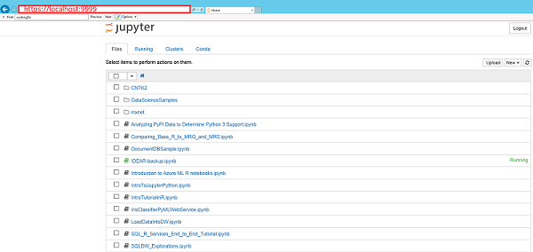

- Upload the IDEAR.ipynb to the Jupyter Notebook server. Locate the IDEAR.ipynb in the same directory as this instruction on the Jupyter Notebook server. Drag and drop the IDEAR.ipynb file to the Jupyter Notebook home page. Then click "Upload" to upload the IDEAR.ipynb file to the home directory of the Jupyter Notebook server. 

	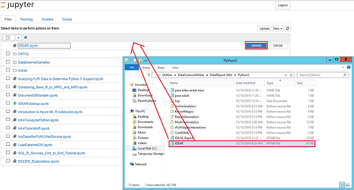

- Open IDEAR.ipynb. If you have multiple Python kernels (such as Python 2.7 and Python 3.5), you can choose either 2.7 or 3.5. Once IDEAR.ipynb is opened, the first cell provides some basic instructions on how to run IDEAR in Jupyter Notebook.

	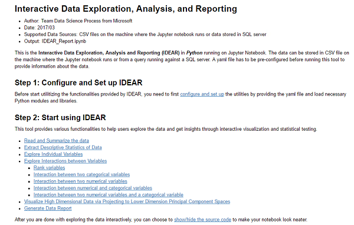

- Configure and set up IDEAR by providing some global parameters. The global parameters you need to provide include:
	- _Working directory_: the absolute path to the directory where this instruction stays on the Jupyter Notebook server machine. You need to set the same working directory in the first two cells. 
	- _YAML file_: the name and the path to the YAML file. The path can be an absolute path, or a relative path to the working directory. In this example, the _para\_adult.yaml_ is just in the working directory. So, we set `conf_file = '.\\para-adult.yaml'` 
	- _Name of the final report_ (a Jupyter Notebook file) that you plan to generate using IDEAR. In this example, we name it as `IDEAR_Report.ipynb`.
	- _Directory to save the temporary files_: Later on, when you use IDEAR to explore the data, you will be able to export the Python scripts that are generating the results you see in IDEAR to some temporary Jupyter Notebooks. All the Jupyter Notebooks in the directory will be merged to generate the final report. Therefore, for each dataset you are exploring using IDEAR, create a separate directory to host these temporary files. 
	- _Sample_Size_: Large dataset can slow down the interactivity when you are using IDEAR. By default, we random sample the data to 10000 observations, if the original data has more than 10000 observations. IDEAR will use the entire dataset to generate the general statistics. When interactivity is needed, the sampled dataset is used. 

	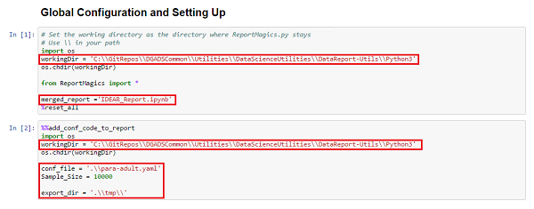

Then, you are all set to run IDEAR to explore and visualize your dataset!

## How to use IDEAR

IDEAR guides you through the exploration of a dataset in an evolving manner:

- from a general data summary to specific variable statistics
- from simple to complex
- from single variable to multiple variables 

You are recommended to run the code cells in IDEAR in an orderly manner, since some cells are depending on the outputs from previous cells. 

Cells _**Global Configuration and Setting Up**_, _**Import necessary packages and set up environment parameters**_, and _**Define some functions for generating reports**_ need to run first in order to import necessary modules or define functions that are going to be used by IDEAR. 

During the interactive process of data exploration, analysis, and visualization, you can click the **Export** button for each analysis and visualization. The Python scripts used to generate the results of your analysis and visualization are output/appended to some temporary Jupyter Notebooks in the directory _export\_dir_ you specified in the second code cell of the IDEAR Jupyter Notebook. You can generate a final data report from the temporary Jupyter Notebooks in this directory. Click the **Generate Final Report** button to merge all temporary Jupyter Notebooks in this directory to a single Jupyter Notebook, which you need to run in order to generate your final report. You can then share this report with your project teammates or with your clients to discuss what insights you obtained from your exploration of the data. 

>[AZURE.NOTE] In IDEAR-Python-AzureNotebooks.ipynb, the _Export_ button is not available since this version of IDEAR does not support reporting. 

## 1. Read and Summarize the Data

This section of cells will:

- Read data into Pandas data frame, and infer column types (numerical or categorical)
- Print the first n rows of data
- Print the dimensions, column names and types of the data

### 1.1. Read data and infer column types

This cell will:

- Parse the yaml file into a dictionary
- Read the data into a Pandas data frame, and sample the data
- If the yaml file does not specify which columns are categorical/numerical, infer all non-numerical/numerical columns as categorical/numerical
- Print which column is the target column, and which columns are categorical and numerical columns. 

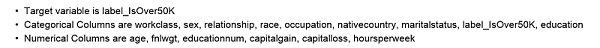

### 1.2. Print the first n rows of the data

This cell prints the first n (n=5 by default) of the data. Drag the scroll bar left or right will print less or more rows of data. This allows users to take a quick peek of the data. 

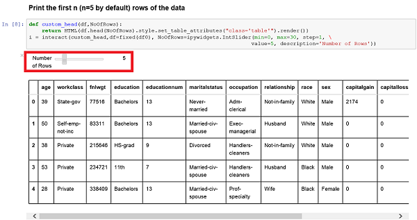

### 1.3 Print the dimensions, column names and types of the data

The following three cells print the dimensions, column names and types of the data. 

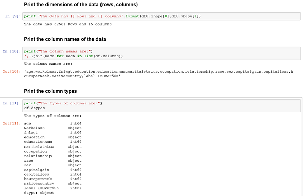

## 2. Extract Descriptive Statistics of Each Column

In this section, descriptive statistics of numerical and categorical columns are extracted and printed separately. 

You need to run the following cell first in order to define functions needed for this section.

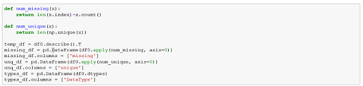

### 2.1. Print the descriptive statistics of numerical columns.

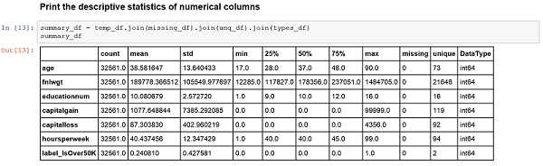

### 2.2. Print the descriptive statistics of categorical columns.

## 3. Explore Individual Variables

In this section, you will explore variables individually, including the target variable, numerical variables, and categorical variables. For numerical variables, histogram, probability density plot, QQ-plot, and box-plot will be plotted. Normality test will be conducted. For categorical variables, histogram and pie chart will be plotted. 

A drop box will be provided to allow you to select the variable you want to explore. 

Categorical column exploration will be based on the entire dataset, and numerical column exploration will be based on the sampled dataset. 

If you like the exploration and visualization result on a variable to be in your final report, click the `Export` button to export the Python code behind the exploration and visualization to a temporary Jupyter Notebook file. This temporary Jupyter Notebook will be used to generate the final report later. 

### 3.1. Explore the target variable

### 3.2. Explore individual numeric variables and test for normality (on sampled data)

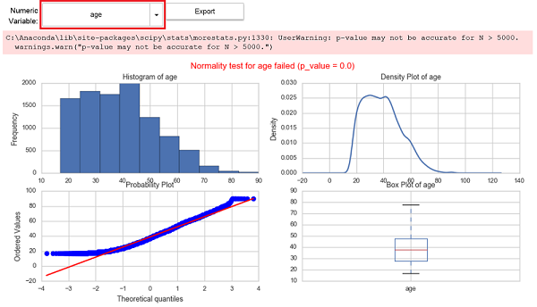

Click the drop down list box to select another numerical variable to explore. 

### 3.3. Explore individual categorical variables (sorted by frequencies)

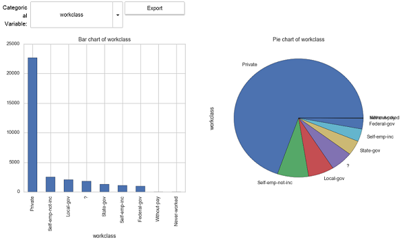

Click the drop down list box to select another categorical variable to explore. 

## 4. Explore Interactions Between Variables

Investigating the interactions and association between variables is an important analysis for understanding the dataset and for determining whether a dataset is relevant for the machine learning task, even before building machine learning models. In this section, we show how to evaluate and visualize inter-variable associations and the subsections corresponds to the IDEAR panes:

- 4.1 Rank variables
- 4.2 Explore interactions between categorical variables
- 4.3 Explore interactions between numerical variables (on sampled data)
- 4.4 Explore correlation matrix between numerical variables
- 4.5 Explore interactions between numerical and categorical variables
- 4.6 Explore interactions between two numerical variables and a categorical variable (on sampled data)

### 4.1. Rank variables

IDEAR calculates the strength of linear relationships between variables in the dataset with a selected reference variable. By default, the reference variable is the target variable. You can choose a different reference variable from the drop list and specify the number of top numerical and categorical variables to analyze. IDEAR then shows the top n variables in two bar charts, one for the top numerical variables, and the other one for the top categorical variables. 

- The associations between categorical and numerical variables are computed using the [eta-squared metric](https://en.wikiversity.org/wiki/Eta-squared "Eta-squared metric"). 
- The associations between categorical variables are computed using the [Cramer' V metric](https://en.wikipedia.org/wiki/Cram%C3%A9r%27s_V "Cramer's V metric").

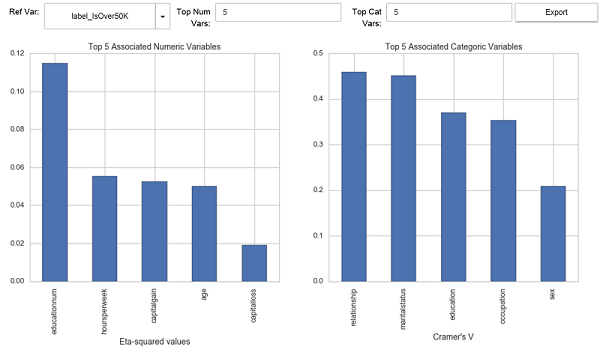

>[AZURE.ALERT] If you notice that certain variables have significantly stronger associations with the target variable than others, they might be **target leakers** that already contain information from the target variable. Think it twice, or consult someone who has domain expertise if this situation arises.

### 4.2. Explore interactions between categorical variables

A [mosaic plot](http://www.datavis.ca/online/mosaics/about.html#toc1 "two-way mosaic plot") shows the proportion of one categorical variable within the classes of another using tiles whose size is proportional to the cell frequency of a 2-way contingency table. The two categorical variables are selected from the drop-down menu boxes. The tiles are colored according to Standardized Pearson residuals (see the previous link). This helps you understand whether two categorical variables are dependent or not.

If the target variable is a categorical variable, by default, Categorical Var 1 is the target variable.

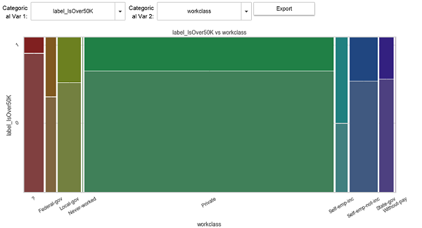

### 4.3. Explore interactions between numerical variables (on sampled data)

A scatter plot shows the association between pairs of numerical variables in the dataset. The two numerical variables are selected from the drop-down menu boxes. The best fit line from a linear model fit is shown in red, and the loss fit line is shown in blue.

If the target variable is a numerical variable, by default, Numerical Var 1 is the target variable.

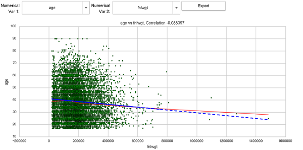

### 4.4. Explore correlation matrix between numerical variables

An all-by-all pair-wise correlation plot shows the association between all pairs of numerical variables the dataset. You can choose one of the three correlation methods: pearson, kendall, and spearman. 

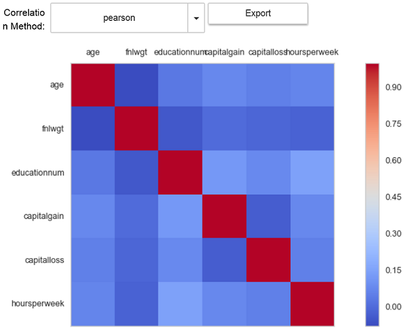

### 4.5. Explore interactions between numerical and categorical variables

The association between a numerical and a categorical variable can be evaluated using a box plot. ANOVA is conducted to test the null hypothesis that the mean values of the numerical variable are the same across the levels of the categorical variable. The p-value of the ANOVA test is shown. If the categorical variable is the target variable for a classification problem, this function indicates whether the numerical variable helps differentiate the different levels of the target variable.

If the target variable is a numerical (categorical) variable, by default, Numerical (Categorical) Variable is the target variable. 

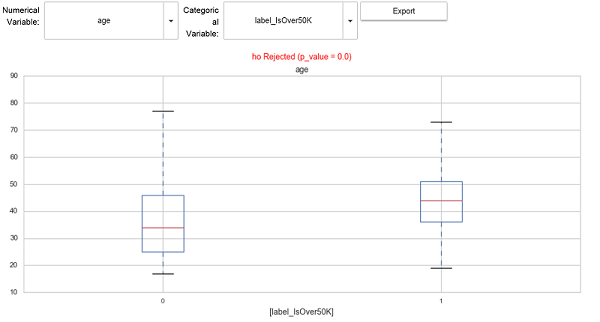

### 4.6. Explore interactions between two numerical variables and a categorical variable (on sampled data)

A scatter plot of two numerical variables are plotted, and points are legended by the selected categorical variable. If the target variable is numerical, Numerical Var 1 is the target variable by default. If the target variable is categorical, Categorical Var is the target variable by default. 

This plot helps understand whether the categorical variable can be separated by the two numerical variables. If the categorical variable is the target variable, it can help access whether these two numerical variables can differentiate the levels of the target variable. If you see clear clustering pattern, where one cluster is dominated by one single level of the target variable, that is a good indicator that these two numerical variables are good predictors. 

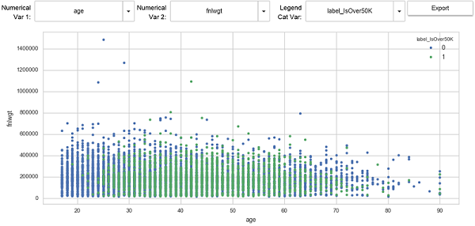

## 5. Visualize Numerical Data by Projecting to Principal Component Spaces

When the dimension of the data is high, data visualization is challenging. But visualizing the data can help us understand the clustering pattern in the data. For classification tasks, if you see separated clusters in the data that are dominated by different classes of the target variable, you may estimate that this classification task might not be so challenging. Otherwise, the classification task might not be easy. You can also use this function to infer the quality of your feature set. 

This function projects the numerical sub-dataset onto a lower 2-D or 3-D space spanned by the principal components. For 2-D projection, you can choose the principal components for x, y using the dropdown menus provided in the IDEAR pane. Changing principal components for these two axes might help reveal some clustering patterns that might be hidden when viewing in other principal component axis.  

The bar chart of the percentage of variance explained by the number of principal components can help you understand how severe the multicollinearity is in the numerical sub-dataset. Put another way, it describes how singular the variance-covariance matrix is. 

For 3-D projection, the data is simply projected to the 1st, 2nd, and 3rd principal components, as the x, y, z axis respectively. In the 3-D projection scatter plot, there is a horizontal scroll bar for you to change the viewing perspective. Some clusters might be hidden behind the others when you look at from one angle. Changing to other angles might help you reveal these hidden clusters. 

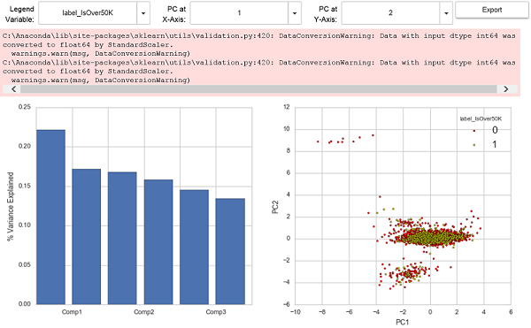

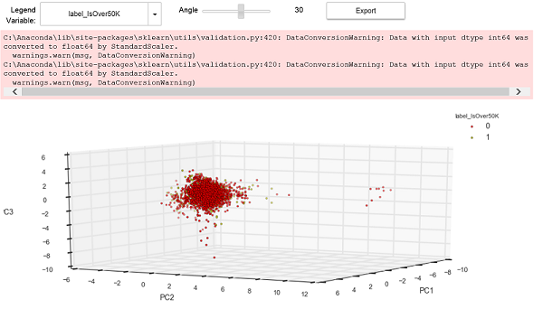

## 6. Show and Hide Codes in IDEAR

After you have all ipywidgets show up in IDEAR, you might want to hide the source codes in the Jupyter Notebook to make it look neater. Then, you just need to play with the ipywidgets to select the variables you want to explore and the analysis you want to conduct. You can do so by running the cell _**Show/Hide the Source Code**_. Then, you can switch on and off the display of the source codes in the Jupyter Notebook by clicking the `Toggle Raw Code` button.
 
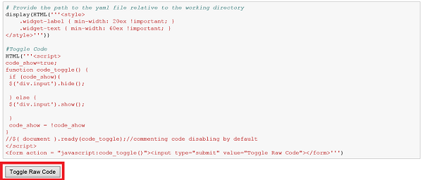

## 7. Generate the Final Report

When you are ready to generate the data report, click the **Generate Final Report** button. The temporary Jupyter Notebook files are merged into a single Jupyter Notebook file IDEAR_Report.ipynb. 

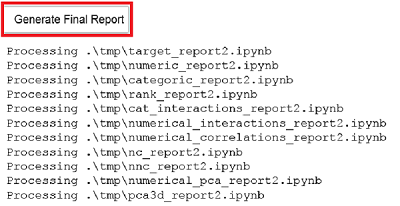

Then, you need to upload the IDEAR_Report.ipynb to your Jupyter Notebook home directory, and run the cells in order to generate the visualization and alaysis results in the final report. The final report also provides the general statistics of the data.

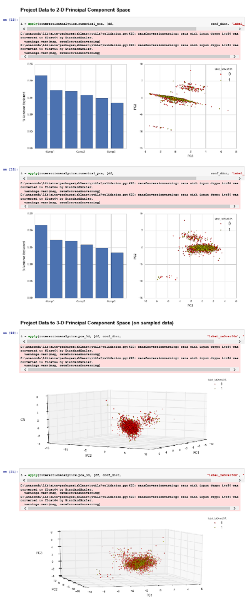

If you want to export the report, in Jupyter notebook, ***click File->Download as***. You can save to formats such as pdf, md, and html.

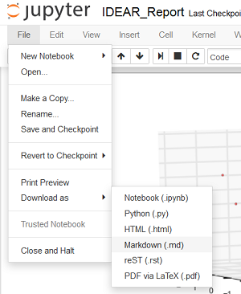

If you are using a source control platform to manage the artifacts of your data science project, we recommended that you check the generate data report into the platform as well. With the support of source control, the data analysis report can be versioned, shared, and collaborated upon by multiple parties. The report provides a 360 view of your dataset, summarizes insights from fundamental analysis, and helps guide following steps such as feature engineering and model building. 

##  Appendix: Instructions on Setting up IDEAR to Run on Azure Notebooks

### 1. Sign in to Azure Notebooks 
Use your Microsoft Account to sign in [Azure Notebooks](https://notebooks.azure.com/) by clicking **Sign In** in the front page.

 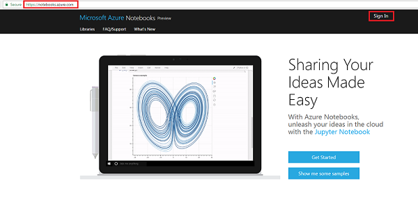

After sign in, you can click **+New Library** to create a library, where you can save your Jupyter notebooks. You can create different libraries for different projects.

 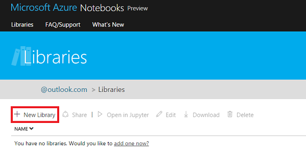

### 2. Upload _IDEAR-Python-AzureNotebooks.ipynb_ to Azure Notebook Service

From the cloned Utilities folder, Utilities --> DataScienceUtilities --> DataReport-Utils --> AzureNotebooks, upload _**IDEAR-Python-AzureNotebooks.ipynb**_ to the library.  

 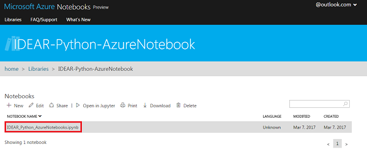

Open this notebook (you can choose Python 3 or 2) you will see the notebook is running on Azure Notebook server:

 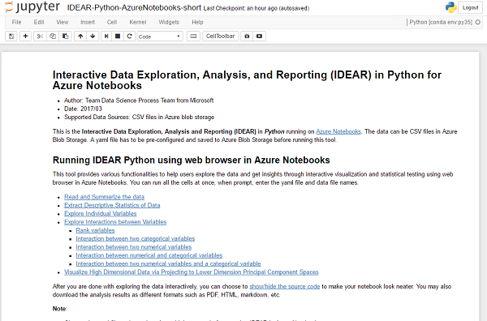

### 3. Upload your data and YAML file to Azure Blob Storage

You can install [Azure Storage Explorer](http://storageexplorer.com/) and upload your data and YAML file to blob storage account under your Azure subscription. Data and yaml files can be in different containers, though in the example notebook they are in the same one.

  

### 4. Set up connection to Azure Blob Storage

All the cells in this notebook can be ran at one. When prompted, type in the storage account name, storage account key, and container name and press enter key to proceed.

 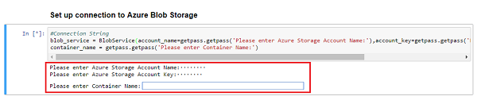

### 5. Specify and load YAML file

Then you will be asked to type in YAML file name, where data set and variables information reside. A screenshot of the YAML file is shown below. 

 

 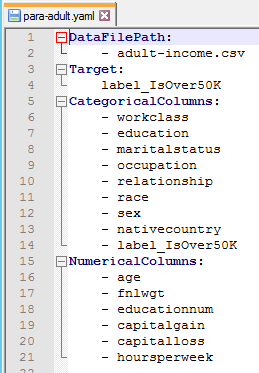