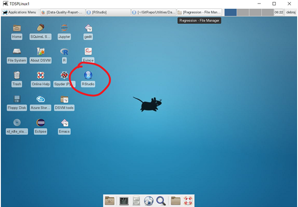
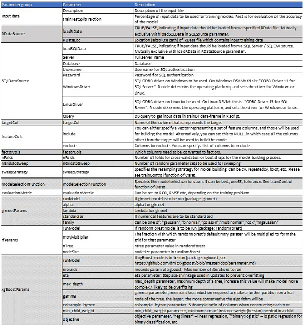
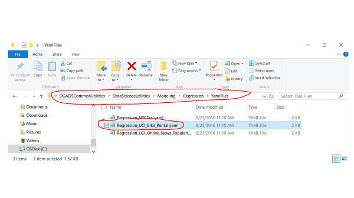
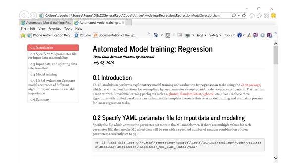
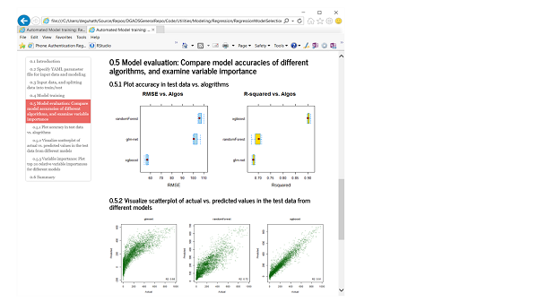
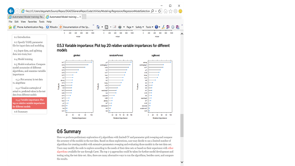

 # Automated Modeling and Reporting in R

----------
Last updated: Sept 23, 2016
Authors: Microsoft TDSP (team-data science process) team

----------

## Objective of the Automated Modeling and Reporting utility ##

The purpose of the Automated Modeling and Reporting utility is to provide a customizable semi-automated tool to train and evaluate single or multiple machine learning models with hyper-parameter sweeping, and compare the accuracy of those models. 

After the utility completes running, a model report will be generated automatically with the following information:

- Model information
- Model evaluation and comparison (if multiple models are trained)
- Feature ranking

This report can provide quick assessment on the quality of the feature set, the difficult of the machine learning task, and can provide guidance for feature engineering and modeling in the next steps. 

----------
## General information and conventions ##

At this time, the tool only works on data-frames in memory. It has been tested in both Linux and Windows systems. 

A YAML file is needed as input to specify the following:
1. Path to the input data (RData file or SQL-server).
2. Proportion of the data to be split into training and testing.
3. Models you want to train, and the grids of model hyperparameters to sweep over.
4. Information about model optimization through parameter sweeping (e.g. cross-validation folds, and how many parameter sets to sweep over).

After the run is complete, a HTML is generated with a table of contents (ToC), which helps users to navigate through different sections of the modeling report.

The Automated Modeling and Reporting utility is a R markdown file that can produce a self-contained html output with a table of contents (ToC) for easy navigation through different sections. The utility primarily uses the [Caret](http://topepo.github.io/caret/index.html "Caret") package and its functions. 

When the utility completes running, the models you specified in the YAML file are trained. The examples coming with this utility have three models (regularized regression using [glmnet](https://cran.r-project.org/web/packages/glmnet/index.html "glmnet") package, random forest using [randomForest](https://cran.r-project.org/web/packages/randomForest/index.html "randomForest") package package, boosting trees using [xgboost](https://cran.r-project.org/web/packages/xgboost/index.html "randomForest") package) specified in the YAML files.

If you do not want to run all three models, you can specify which ones to run in the parameter settings file (.yaml). Also, if you are interested in adding models other than these three, you can easily do that also. Caret provides ability to run [> 200 different models](http://topepo.github.io/caret/available-models.html "> 200 different models"). See **Additional information** below for further details.

Accuracy of the models are then compared, and relative feature importance plots are reported. Caret supports many algorithms, so, additional algorithms can be added to the utility with minimal effort.

Currently, the Automated Modeling and Reporting utility is provided in two .rmd files: 
1.	For binary classification task, use BinaryModelSelection.rmd
2.	For regression task, use RegressionModelSelection.rmd
The primary differences being the way control parameters and accuracy metrics are specified for these learning tasks. 

----------
## Prerequisites ##

1. **Have R 3.2.3 or newer version installed** on your machine. 
2. **Have RStudio installed** on your machine. Launch RStudio. 
3. The data you are training models on has been saved as a .RData file on your machine. The data frame that is in the .RData file should have already defined the types of the variables. 

> If you are using Linux (CentOS) Data Science Virtual Machine (DSVM) on Azure, there is an installation script _installRStudio.sh_ on under “Desktop/DSVM tools/”. Run this script will install the RStudio for you. For more details, please refer to the [DSVM Tools page](https://azure.microsoft.com/en-us/documentation/articles/machine-learning-data-science-linux-dsvm-intro/#tools-installed-on-the-linux-data-science-virtual-machine). 
> DSVM has R 3.2.3 (Linux) or R 3.2.5 (Windows) installed for you by default. 
> If you are using a Linux machine, you should use x2go to remotely access the Linux machine from Windows client or other client which can run x2go client. X2Go provides a GUI based remote access to the Linux machine. You can [install X2Go on your client](https://azure.microsoft.com/en-us/documentation/articles/machine-learning-data-science-linux-dsvm-intro/#installing-and-configuring-x2go-client "Installing and configuring X2Go client"). Then login to the DSVM using X2Go. The X2Go interface appears as the following image.

> We have tested the Automated Modeling and Reporting utility on both Windows and Linux (CentOS) DSVM. It might work in other machines, but we have not tested. 

Now you are ready to run the code for generating the data-quality and exploration report. 

----------
## Sample datasets for quickly trying the Automated Modeling and Reporting utility 

In this section we will describe two sample datasets which come with this utility in GitHub repository. You can use these two datasets to get a sense of how to use the utility easily. Yaml files for these datasets are provided in the "YamlFiles" sub-folder under the folders for binary classification and regression.  
 
1. [UCI (Univ. of California, Irvine) Bike rental/sharing](https://archive.ics.uci.edu/ml/datasets/Bike+Sharing+Dataset "UCI Bike rental/sharing"): Dataset for regression task. This dataset contains the hourly and daily count of rental bikes between years 2011 and 2012 in Capital bikeshare system with the corresponding weather and seasonal information. The task is to predict hourly bike rental counts based on weather conditions, hour, day, week, and month information.
2. [UCI adult income](https://archive.ics.uci.edu/ml/datasets/Adult "UCI adult income"): Dataset for binary classification task. This dataset is from the 1994 census, and the prediction task is to determine whether a person makes over 50K a year based on features such as demographic and education level. 

----------

## Sample YAML files to define parameters for the modeling runs ##

When you run the utility, you need to let the utility know which YAML file to run against. The YAML file specifies the information about the data-set to be used for training, such as the location and the format (SQL table and R-data sets are supported), the baseline models you want to train, the hyperparameter set to sweep over, number of cross-validation folds to be used for training etc. Below is an example Yaml file for the UCI bike rental/sharing data-set.

**InputData:** 
    - 'Description = "UCI Bike Rental Regressoin Dataset"' 
    - 'trainTestSplitFraction = 0.75' 
**RDataSource:** 
    - 'loadRData = TRUE' 
    - 'RDataLoc = "C:\\Users\\remoteuser\\Source\\Repos\\DGADSCommonUtilities\\Data\\Common\\UCI_Bike_Rental\\BikeSharingHour.RData"' 
**SQLSource:** 
    - 'loadSQLData = FALSE' 
    - 'Server = "deyrl0lfcu.database.windows.net"' 
    - 'Database = "SQLDWCDSP"' 
    - 'Username = "datascience"' 
    - 'Password = "D@tascientist"' 
    - 'WindowsDriver = "ODBC Driver 11 for SQL Server"' 
    - 'LinuxDriver = "ODBC Driver 13 for SQL Server"' 
    - 'Query = "SELECT * FROM table_name"' 
**targetCol:** 
    - "cnt" 
**featureCols:** 
    - 'include = c("season","yr","mnth","hr","holiday","weekday","workingday","weathersit","temp","atemp","hum","windspeed")' 
    - 'exclude = NULL' 
**factorCols:** 
    - 'factorCols = c("season","yr","mnth","hr","holiday","weekday","workingday","weathersit")' 
**nFolds:** 
    - 3 
**nGridstoSweep:** 
    - 59 
**sweepStrategy:** 
    - "cv" 
**modelSelectionFunction:** 
    - "oneSE" 
**evaluationMetric:** 
    - "RMSE" 
**glmnetParams:** 
    - 'runModel = TRUE' 
    - 'alpha = c(0.1, 0.5, 0.9)' 
    - 'lambda = c(0.001, 0.01, 0.1, 1, 2)' 
    - 'standardize = TRUE' 
    - 'family = "gaussian"' 
**rfParams:** 
    - 'runModel = TRUE' 
    - 'mtryMultiplier = c(0.5, 0.66, 1, 1.5, 2)' 
    - 'nTree = 50' 
    - 'nodeSize = 100' 
**xgBoostParams:** 
    - 'runModel = TRUE' 
    - 'nrounds = c(25, 50, 100)' 
    - 'eta = c(0.01, 0.025, 0.05, 0.1, 0.5, 1)' 
    - 'max_depth = c(2,4,6)' 
    - 'gamma = c(1, 2, 5)' 
    - 'colsample_bytree = c(0.5, 0.75, 1)' 
    - 'min_child_weight = c(10, 50, 100)' 
    - 'objective = "reg:linear"' 
 

Descriptions of the parameters in the YAML file are given below:
.

> [AZURE.NOTE] At this time input sources supported are data frames saved in .RData files and a SQL Server source. 

----------
## Running Automated Modeling and Reporting Utility in RStudio ##

There are two ways to run the R markdown file

- **Using command-line in RStudio console (Works in both Windows and Linux)**
	- First navigate to the directory that contains the modeling .rmd file.  
	- From the directory that contains the RMarkdown file: 
		- Regression: `rmarkdown::render("RegressionModelSelection.rmd")` 
		- Binary classification: `rmarkdown::render("BinaryModelSelection.rmd")` 
- **Using ‘knit HTML’ in RStudio (Works on Windows Only)**

    This works only on Windows DSVM. Open the file .rmd file in RStudio, and click on knit HTML at the top.

Once you start running (with either option 1 or 2), a file selection box will pop up for you to choose the Yaml parameter file:

----------

## Description of the output HTML report ##

###Example output shown for the UCI bike rental/sharing data-set.###

The output HTML file has 6 sections. 

> [AZURE.NOTE]To enable the floating toc on the left, you may have to “allow blocked content” when you open the HTML file. 

### Model information
The first three sections contain output regarding the data, and some key parameters from the Yaml file. Section 4 shows the training formula and which models are being trained.

### Model evaluation
Section 5 contains model evaluation. 

- Section 5.1 contains model accuracy evaluated on the test dataset vs. different algorithms. The evaluation metrics are RMSE and R-sqr for regression, AUC, sensitivity and specificity for binary classification.  

- Section 5.2 contains actual vs. predicted value plots by different algorithm for regression, and ROC plots for binary classification. 

### Feature importance

Section 5.3 contains information about relative feature importance of the models produced by the run. Relative importance (x-axis) of the top 20 features (y axis) are shown for each model. 

### Summary
The summary contains information about the modeling process, and additional models that can be created using the Caret package. You can include additional information here to summarize for your clients the performance of models and other discussions points about your models.

----------
## Additional information

###How to add other models###
If you do not want to run all three models, you can specify which ones to run in the parameter settings file (.yaml). Also, if you are interested in adding models other than these three, you can easily do that also. Caret provides ability to run [> 200 different models](http://topepo.github.io/caret/available-models.html "> 200 different models"). You can also create custom models that are not supported yet by Caret by following the instructions given [here](http://topepo.github.io/caret/using-your-own-model-in-train.html "here").

For adding other models, you will need to modify the yaml file as well as the R-markdown file. You can follow the examples of how current models are included, and replicate that for the other model you want to include. 

----------
