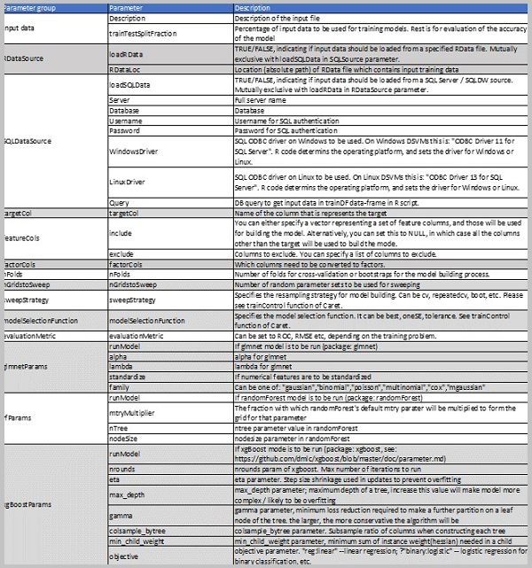
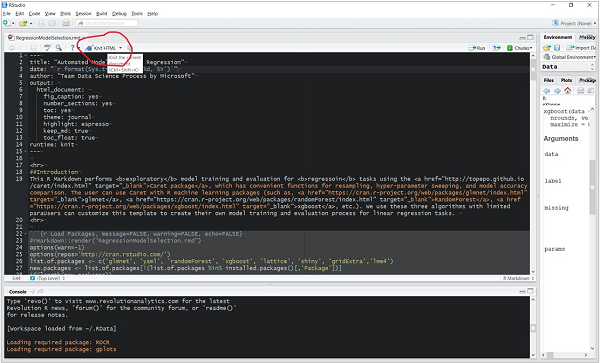
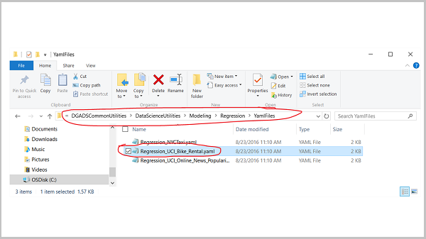
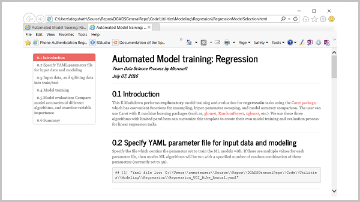
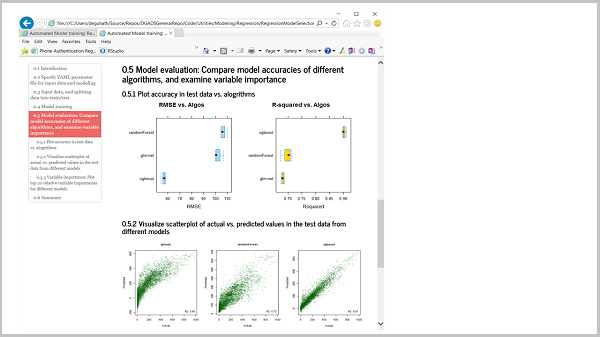
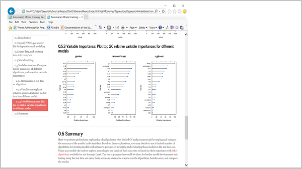

<properties
	pageTitle="Automated modeling and reporting in R"
	description="To provide a customizable semi-automated tool to train and evaluate machine learning models."  
	services="machine-learning"
	documentationCenter=""
	authors="bradsev"
	manager="jhubbard"
	editor="cgronlun" />

<tags
	ms.service="machine-learning"
	ms.workload="data-services"
	ms.tgt_pltfrm="na"
	ms.devlang="na"
	ms.topic="article"
	ms.date="09/24/2016"
	ms.author="bradsev;hangzh;"/>

# Automated modeling and reporting in R

The purpose of the Automated Modeling and Reporting utility is to provide a customizable, semi-automated tool to train and evaluate single or multiple machine learning models with hyper-parameter sweeping and to compare the accuracy of those models. 

A model report is generated automatically when the utility completes running. The model report contains the following information:

- Model information
- Model evaluation and comparison (if multiple models are trained)
- Feature ranking

This report can provide a quick assessment on the quality of the feature set, the difficult of the machine learning task, and can provide guidance for subsequent feature engineering and modeling. 

## General information and conventions

Currently, the tool only works on data frames in memory. The utility reads in a data-frame into memory and starts the modeling process. The training data-frame will have to be saved as "trainDF" prior to using it with this utility. It has been tested in both Linux and Windows systems. 

A YAML file is needed as input to specify the following:

1. Path to the input data (RData file or SQL-server).
2. Proportion of the data to be split into training and testing.
3. Models you want to train, and the grids of model hyperparameters to sweep over.
4. Information about model optimization through parameter sweeping, such as cross-validation folds and the number of parameter sets to sweep over.

In the YAML file, you need to set the path to your data file correctly. Windows and Linux have different conventions for directory structures:

- “\\” for Windows 
- “/” for Linux.

So be sure to set the path appropriately for the OS of your machine.

The Automated Modeling and Reporting utility is an R markdown file that produces self-contained HTML output with a table of contents (TOC) for easy navigation through different sections of the modeling report. The utility primarily uses the [Caret](http://topepo.github.io/caret/index.html "Caret") package and its functions. 

When the utility completes running, the models you specified in the YAML file are trained. The example that comes with this utility have three models specified in the YAML file:

- Regularized regression using [glmnet](https://cran.r-project.org/web/packages/glmnet/index.html) package 
- Random forest using [randomForest](https://cran.r-project.org/web/packages/randomForest/index.html) package
- Boosted decision trees using [xgboost](https://cran.r-project.org/web/packages/xgboost/index.html) package

If you do not want to run all three models, you can specify which ones to run in the parameter settings of the YAML file. The accuracy of the models is compared by Caret and relative feature importance plots are reported. Currently, the Automated Modeling and Reporting utility is provided in two _.rmd_ files:

1.	For **binary classification task**, use BinaryModelSelection.rmd
2.	For **regression task**, use RegressionModelSelection.rmd

The primary differences between them is the way control parameters and accuracy metrics are specified for these learning tasks. 

It is, of course, possible to run additional models other than the three included here. Caret provides ability to run more than 200 different models]. For a list of the models, see [Available models](http://topepo.github.io/caret/available-models.html). For more information about using Caret and creating custom models, see the **Additional information** section at the end of this topic.

## Prerequisites

You must have the following components on your machine:

- **R 3.2.3 or newer version** The Data Science VM on Azure has R 3.2.3 (Linux) or R 3.2.5 (Windows) installed for you by default. 
- **RStudio**
- A .RData file that contains **data** on which you are training the models. The data frame that is in the .RData file should have already defined the variable types being used. 

If you are using Linux (CentOS) Data Science Virtual Machine (DSVM) on Azure, there is an installation script ***installRStudio.sh*** in the **“Desktop/DSVM tools/”** directory. Running this script installs RStudio. For more information, see [Tools installed on the Linux Data Science Virtual Machine](https://azure.microsoft.com/en-us/documentation/articles/machine-learning-data-science-linux-dsvm-intro/#tools-installed-on-the-linux-data-science-virtual-machine). 

If you are using a Linux machine remotely, you can use **X2Go** to access the Linux machine from a Windows or other client that can run X2Go. The X2Go client provides a GUI-based remote access to the Linux machine. For installation instructions, see [Installing and configuring X2Go client](https://azure.microsoft.com/en-us/documentation/articles/machine-learning-data-science-linux-dsvm-intro/#installing-and-configuring-x2go-client). 

Log in to the DSVM using X2Go after it has been installed. The X2Go interface appears as the following image.

We have tested the Automated Modeling and Reporting utility on both Windows and Linux (CentOS) DSVM. It might also work on other machines, but we have not tested. 

## Sample datasets for the Automated Modeling and Reporting utility 

In this section, we describe the two sample datasets which come with this utility in the GitHub repository. You can use these datasets to get a sense of how to use the utility. YAML files for these datasets are provided in the **YamlFiles** sub-folder under the folders for binary classification and regression.  
 
1. [UCI (Univ. of California, Irvine) Bike Sharing Dataset Data Set](https://archive.ics.uci.edu/ml/datasets/Bike+Sharing+Dataset): Dataset for a regression task. This dataset contains the hourly and daily count of rental bikes between years 2011 and 2012 in Capital bikeshare system with the corresponding weather and seasonal information. The task is to predict hourly bike rental counts based on weather conditions, hour, day, week, and month information.
2. [UCI adult income](https://archive.ics.uci.edu/ml/datasets/Adult): Dataset for a binary classification task. This dataset is from the 1994 census. The prediction task is to determine whether a person makes over $50K a year based on features such as demographic and education level. 

## Sample YAML files to define parameters for the modeling runs

When you run the utility, you need to specify the YAML file it is to run against. The YAML file specifies the information about the data-set to be used for training, such as:

- the location of the data
- the format of the data(SQL table and R-data sets are supported) 
- the baseline models to train 
- the hyperparameter set to sweep over 
- the number of cross-validation folds to be used for training 

Here is an example YAML file for the UCI bike rental/sharing dataset.

**InputData:** 
    - 'Description = "UCI Bike Rental Regression Dataset"' 
    - 'trainTestSplitFraction = 0.75' 
**RDataSource:** 
    - 'loadRData = TRUE' 
    - 'RDataLoc = "complete\\\path\\\to\\\the\\\RData\\\BikeSharingHour.RData"' 
**SQLSource:** 
    - 'loadSQLData = FALSE' 
    - 'Server = "\<servername\>.database.windows.net"' 
    - 'Database = "\<database name\>"' 
    - 'Username = "\<user name\>"' 
    - 'Password = "\<password\>"' 
    - 'WindowsDriver = "ODBC Driver 11 for SQL Server"' 
    - 'LinuxDriver = "ODBC Driver 13 for SQL Server"' 
    - 'Query = "SELECT * FROM table_name"' 
**targetCol:** 
    - "cnt" 
**featureCols:** 
    - 'include = c("season","yr","mnth","hr","holiday","weekday","workingday","weathersit","temp","atemp","hum","windspeed")' 
    - 'exclude = NULL' 
**factorCols:** 
    - 'factorCols = c("season","yr","mnth","hr","holiday","weekday","workingday","weathersit")' 
**nFolds:** 
    - 3 
**nGridstoSweep:** 
    - 59 
**sweepStrategy:** 
    - "cv" 
**modelSelectionFunction:** 
    - "oneSE" 
**evaluationMetric:** 
    - "RMSE" 
**glmnetParams:** 
    - 'runModel = TRUE' 
    - 'alpha = c(0.1, 0.5, 0.9)' 
    - 'lambda = c(0.001, 0.01, 0.1, 1, 2)' 
    - 'standardize = TRUE' 
    - 'family = "gaussian"' 
**rfParams:** 
    - 'runModel = TRUE' 
    - 'mtryMultiplier = c(0.5, 0.66, 1, 1.5, 2)' 
    - 'nTree = 50' 
    - 'nodeSize = 100' 
**xgBoostParams:** 
    - 'runModel = TRUE' 
    - 'nrounds = c(25, 50, 100)' 
    - 'eta = c(0.01, 0.025, 0.05, 0.1, 0.5, 1)' 
    - 'max_depth = c(2,4,6)' 
    - 'gamma = c(1, 2, 5)' 
    - 'colsample_bytree = c(0.5, 0.75, 1)' 
    - 'min_child_weight = c(10, 50, 100)' 
    - 'objective = "reg:linear"' 
 

Descriptions of the parameters in the YAML file are shown in the following figure:

.

> [AZURE.NOTE] Currently, input sources supported are data frames saved in .RData files and a SQL Server source. 

## Running Automated Modeling and Reporting Utility in RStudio

There are two ways to run the R markdown file:

- **Using command-line in RStudio console** (Works in both Windows and Linux) Navigate to the directory that contains the modeling .rmd file. Then from the directory that contains the RMarkdown file, use the following commands, respectively, for regression and classification: 
	- **Regression**: `rmarkdown::render("RegressionModelSelection.rmd")`
	- **Binary classification**: `rmarkdown::render("BinaryModelSelection.rmd")`
- **Using ‘knit HTML’ in RStudio** (Works on Windows Only) This works only on Windows DSVM. Open the file .rmd file in RStudio, and click **knit HTML** at the top.

A file selection box pops up for you to choose the YAML parameter file once you start running (either with option 1 or 2):

## Description of the output HTML report

###Example output shown for the UCI bike rental/sharing data-set.

The output HTML file has 6 sections. 

> [AZURE.NOTE]To enable the floating TOC on the left, you may have to “allow blocked content” when you open the HTML file. 

### Model information
**Sections 1-3** contain output regarding the data, and some key parameters from the YAML file. 

**Section 4** shows the training formula and which models are being trained.

### Model evaluation
**Section 5** contains information on model evaluation.

- **Section 5.1** contains the accuracy of different models evaluated on the test dataset. The evaluation metrics are RMSE and R-sqr for regression, AUC, sensitivity and specificity for binary classification. 
- **Section 5.2** contains actual vs. predicted value plots obtained by different algorithm for regression, and ROC plots for binary classification. 

### Feature importance

**Section 5.3** contains information about relative feature importance of the models produced by the run. Relative importance (x-axis) of the top 10 features (y axis) are shown for each model. 

### Summary
The summary in **Section 6** contains information about the modeling process and additional models that can be created using the Caret package. You can include additional information here to summarize the performance of models and other discussions points about your models for your clients.

## Additional information

### How to add other models
If you do not want to run all three models, you can specify which ones to run in the parameter settings file (.yaml). Also, if you are interested in adding models, other than these three, you can use Caret to do this. Caret provides ability to run [> 200 different models](http://topepo.github.io/caret/available-models.html). You can also create custom models that are not supported by Caret yet by following the instructions given [here](http://topepo.github.io/caret/using-your-own-model-in-train.html).

To add other models, you need to modify the YAML file as well as the R-markdown file. You can use the examples of how current models are included to see how to include other models. 

